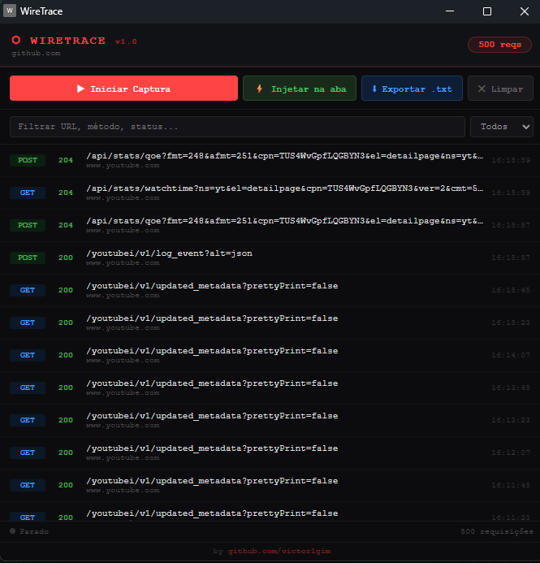

# ⬡ WireTrace

> Captura requisições Fetch/XHR de qualquer site e exporta como script Python pronto para reuso.


---

## O que é

WireTrace é uma extensão para Chrome voltada para desenvolvedores e pentesters. Ela intercepta todas as requisições `fetch` e `XMLHttpRequest` feitas por um site, captura headers, body, status e cookies reais (incluindo HttpOnly), e gera automaticamente um script Python com `requests` pronto para reproduzir cada chamada.



---

## Funcionalidades

- Intercepta `fetch` e `XHR` em tempo real
- Captura headers completos, body (JSON ou texto), status HTTP e cookies reais do browser (inclusive HttpOnly)
- Filtragem por URL, método e status
- Exporta tudo como script `.txt` Python com `requests`, estruturado por função
- Injeção manual na aba ativa via botão
- Reinjeção automática em navegação (SPA e recarregamento)
- Painel flutuante com LED de status e contador de requisições

---

## Instalação

### 1. Clone o repositório

```bash
git clone https://github.com/victorlgim/wiretrace.git
cd wiretrace
```

### 2. Abra o Chrome e acesse as extensões

```
chrome://extensions
```

### 3. Ative o Modo do Desenvolvedor

No canto superior direito da página, ative a chave **"Modo do desenvolvedor"**.

### 4. Carregue a extensão

Clique em **"Carregar sem compactação"** e selecione a pasta do projeto (onde está o `manifest.json`).

### 5. Pronto

O ícone do WireTrace aparecerá na barra de extensões do Chrome.

---

## Como usar

1. Clique no ícone **⬡ WireTrace** na barra do Chrome para abrir o painel
2. Clique em **▶ Iniciar Captura** para ativar
3. Clique em **⚡ Injetar na aba** na aba do site que deseja monitorar (ou pressione `F5` para recarregar)
4. Interaja com o site normalmente — login, navegação, formulários, etc.
5. As requisições aparecem em tempo real no painel
6. Clique em **⬇ Exportar .txt** para baixar o script Python gerado

---

## Exemplo de saída exportada

```python
import requests

# ──────────────────────────────────────────────────────────
# [1] POST /api/login  →  HTTP 200
def req_01_post():
    cookies = {
        'session': 'abc123',
    }
    headers = {
        'content-type': 'application/json',
        'user-agent': 'Mozilla/5.0 ...',
    }
    json_body = {
        "email": "user@example.com",
        "password": "secret"
    }
    response = requests.post('https://example.com/api/login', cookies=cookies, headers=headers, json=json_body)
    print(response.text[:400])
    return response
```

---

## Estrutura do projeto

```
wiretrace/
├── manifest.json     # Configuração da extensão (MV3)
├── background.js     # Service worker: injeção, captura e enriquecimento com cookies
├── panel.html        # Interface do painel
├── panel.js          # Lógica do painel: render, export, filtros
└── icon.png          # Ícone da extensão
```

---

## Permissões utilizadas

| Permissão | Motivo |
|---|---|
| `activeTab` / `tabs` | Identificar e injetar na aba ativa |
| `scripting` | Injetar o interceptor na página |
| `storage` | Persistir requisições capturadas |
| `downloads` | Exportar o script gerado |
| `webNavigation` | Reinjetar em navegações SPA |
| `cookies` | Capturar cookies reais (incluindo HttpOnly) |
| `host_permissions: <all_urls>` | Funcionar em qualquer domínio |

---

## Aviso

Esta ferramenta foi desenvolvida para fins educacionais e de testes em ambientes autorizados. Não utilize em sistemas sem permissão explícita do proprietário.

---

## Autor

Desenvolvido por [victorlgim](https://github.com/victorlgim)